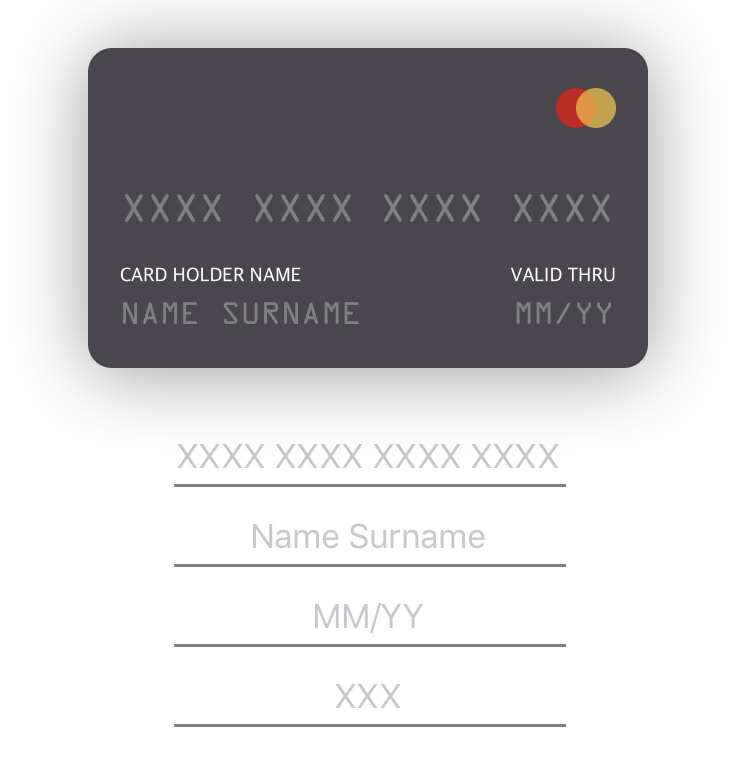

<p align="center">
  
  
  <a href="https://github.com/Carthage/Carthage">
    
  </a>
    <a href="https://cocoapods.org/">
    
  </a>
  
  
</p>

<p align="center">

</p>

## 🎬 Preview
<p align="center">

</p>

## 🌟 Features
- [x] Easily usable
- [x] Simple Swift syntax
- [x] Cool flip animation
- [x] Compatible with `Carthage`
- [x] Compatible with `CocoaPods`
- [x] Customizable
- [x] Universal (iPhone & iPad)
- [x] Lightweight readable codebase
- [x] And More...

## 📲 Installation

#### Using [CocoaPods](https://cocoapods.org)

Edit your `Podfile` and specify the dependency:

```ruby
pod "YRPayment"
```

#### Using [Carthage](https://github.com/carthage)

Edit your `Cartfile` and specify the dependency:

```bash
github "yassram/YRPayment"
```

## 🐒 How to use

In **4** steps:

**1.** Import YRPayment.
```swift
import YRPayment
```

**2.** Create a YRPaymentCreditCard instance and link it to a YRPayement instances:
```swift
let card = YRPaymentCreditCard()
let payment = YRPayment(creditCard: card)
```

**3.** Add your card to a view and set its position: 
```swift
view.addSubview(card)
card.centerXAnchor.constraint(equalTo: view.centerXAnchor).isActive = true
card.centerYAnchor.constraint(equalTo: view.centerYAnchor).isActive = true
```
**4.** link your textFields to the payment object: 
```swift
payment.numberTextField = NumberTF
payment.holderNameTextField = NameTF
payment.validityTextField = ValidityTF
payment.cryptogramTextField = cryptoTF
```
> *(Assuming that NumberTF, NameTF, ValidityTF, cryptoTF are textField alrready created)*

**5.** Enjoooooooy ! 
<p align="center">

</p>

## 🙏 Contributing
This is an open source project, so feel free to contribute. How?
- Open an <a href="https://github.com/Juanpe/YRPayment/issues/new"> issue</a>.
- Send feedback via <a href="mailto:ramsserio@gmail.com">email</a>.
- Propose your own fixes, suggestions and open a pull request with the changes.


## 📢 Mentions
Did you mention `YRPayment` in your website, do you use it in your app ? send me a <a href="mailto:ramsserio@gmail.com">message</a> to be added in this section!
<br>
<br>
<br>


## 💻 Author

* Yassir Ramdani


## 📝 License

```
MIT License

Copyright (c) 2019 yassir RAMDANI

Permission is hereby granted, free of charge, to any person obtaining a copy
of this software and associated documentation files (the "Software"), to deal
in the Software without restriction, including without limitation the rights
to use, copy, modify, merge, publish, distribute, sublicense, and/or sell
copies of the Software, and to permit persons to whom the Software is
furnished to do so, subject to the following conditions:

The above copyright notice and this permission notice shall be included in all
copies or substantial portions of the Software.

THE SOFTWARE IS PROVIDED "AS IS", WITHOUT WARRANTY OF ANY KIND, EXPRESS OR
IMPLIED, INCLUDING BUT NOT LIMITED TO THE WARRANTIES OF MERCHANTABILITY,
FITNESS FOR A PARTICULAR PURPOSE AND NONINFRINGEMENT. IN NO EVENT SHALL THE
AUTHORS OR COPYRIGHT HOLDERS BE LIABLE FOR ANY CLAIM, DAMAGES OR OTHER
LIABILITY, WHETHER IN AN ACTION OF CONTRACT, TORT OR OTHERWISE, ARISING FROM,
OUT OF OR IN CONNECTION WITH THE SOFTWARE OR THE USE OR OTHER DEALINGS IN THE
SOFTWARE.

```
